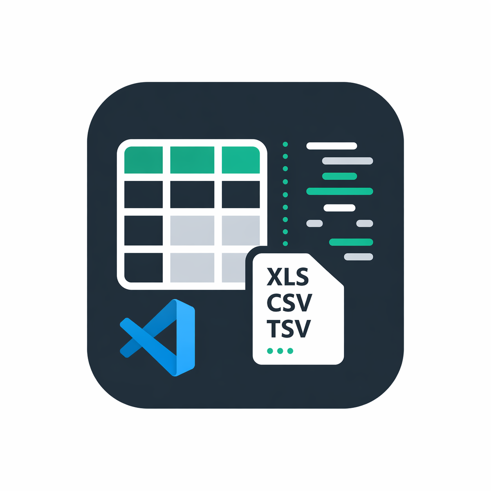
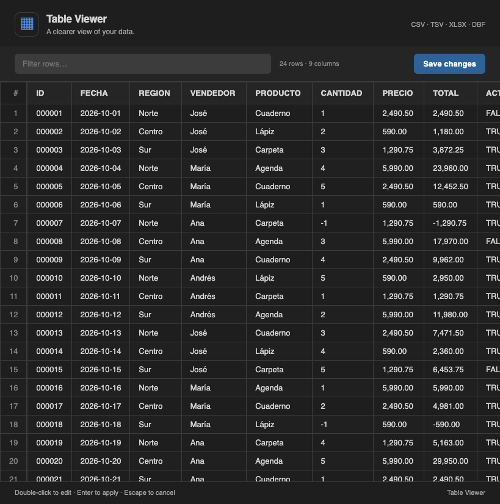
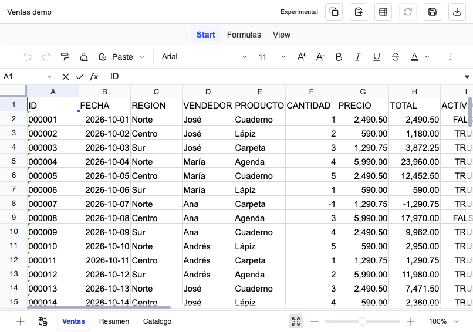
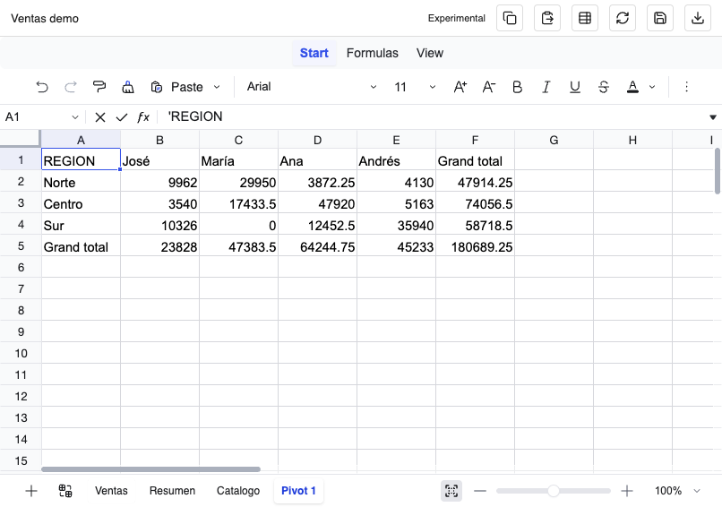
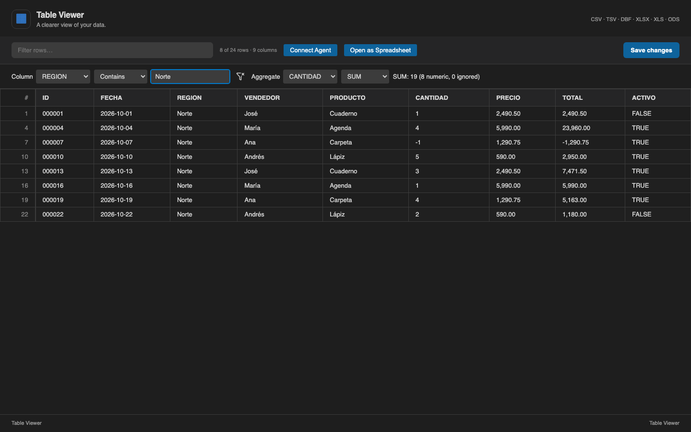
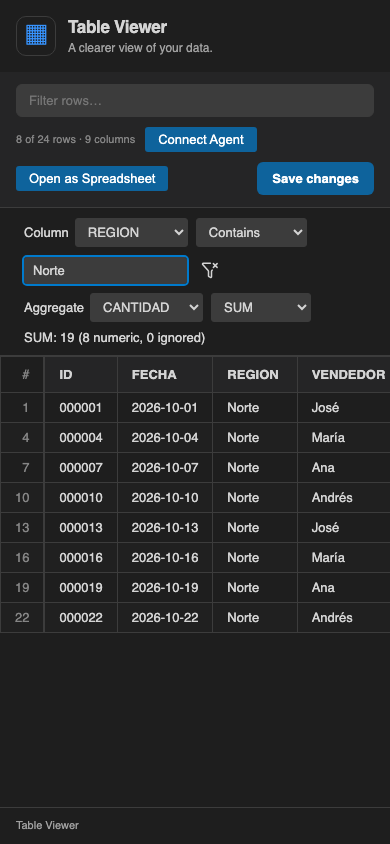
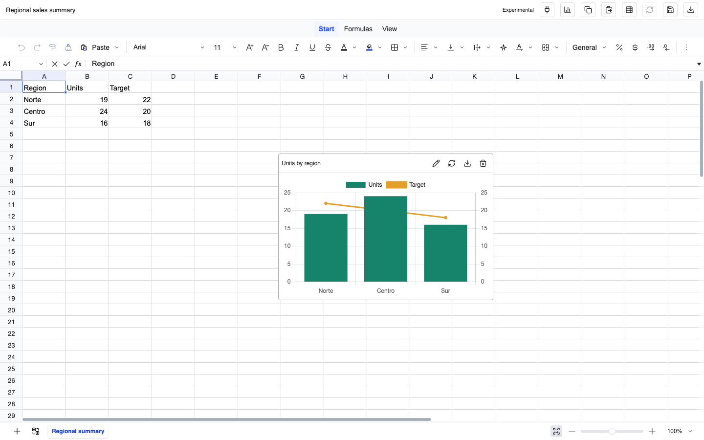

  
  <h1>CSV / XLS Table Viewer</h1>
  
<strong>Explora una tabla o trabaja en una hoja de cálculo. Sin salir de VS Code.</strong>

  
Revisa archivos tabulares directamente, o importa una copia de trabajo con fórmulas, formato y resúmenes dinámicos.

  
<a href="README.md">English</a> · <strong>Español</strong>

  
<a href="#primeros-pasos">Primeros pasos</a> · <a href="#capturas">Capturas</a> · <a href="docs/es/changelog.md">Cambios</a> · <a href="https://github.com/lnavarrocarter/vscode-table-viewer/issues">Reportar un problema</a>

  
  
  

---

## Elige tu flujo de trabajo

| Table Viewer | Spreadsheet (Experimental) |
| --- | --- |
| Abre CSV, TSV, XLSX, XLS, ODS o DBF como una tabla que puedes buscar y ordenar. Edita celdas existentes y guarda. | Importa CSV, TSV, TXT tabulado, XLSX, XLS, ODS o DBF a una copia de trabajo `.sheet.json`. Edita celdas, usa fórmulas y formato, y crea resúmenes dinámicos básicos. |

Al importar en Spreadsheet, el archivo original permanece intacto. El editor experimental usa el motor local Univer OSS y no necesita servidor ni CDN.

## Capturas

**Table Viewer:** filtra y edita una tabla familiar.

**Editor spreadsheet:** fórmulas y datos ficticios de ventas.

**Resumen dinámico:** ventas agrupadas por región y vendedor.

### Filtros por columna y agregaciones

### Gráficos movibles

Las capturas nuevas usan el preview local con un host VS Code simulado, ventas ficticias y un resumen regional ficticio. No muestran una conexión real a Copilot. El archivo de ventas es [examples/ventas-demo.xlsx](examples/ventas-demo.xlsx).

## Primeros pasos

Requiere **VS Code 1.105 o posterior**. Los nombres de los controles se muestran en inglés, como en la interfaz de la extensión.

1. En VS Code, abre **Extensions**, busca `CSV / XLS Table Viewer` e instala la extensión.
2. Abre un archivo CSV, TSV, XLSX, XLS, ODS o DBF para usar **Table Viewer**. Si hace falta, haz clic derecho en su pestaña y selecciona **Reopen Editor With… → Table Viewer**.
3. Para usar fórmulas o resúmenes dinámicos, ejecuta **Table Viewer: Import into Spreadsheet (Experimental)** desde la paleta de comandos y guarda una copia de trabajo `.sheet.json` separada.
4. En Table Viewer, haz doble clic en una celda y usa **Save changes** o **Ctrl+S** / **Cmd+S**. En Spreadsheet, guarda desde la barra o con el mismo atajo.

También puedes instalar un `.vsix` de [GitHub Releases](https://github.com/lnavarrocarter/vscode-table-viewer/releases) desde **Extensions → … → Install from VSIX…**. Para crear el paquete localmente, consulta la [guía de desarrollo](docs/DEVELOPMENT.es.md).

### Archivos de ejemplo

- [Libro de ventas](examples/ventas-demo.xlsx)
- [Tabla DBF/FoxPro equivalente, de solo lectura](examples/ventas-demo.dbf)

Todos los registros son ficticios. Para un ejemplo financiero con agentes, consulta la [guía de conciliación](examples/CONCILIACION.es.md), las [facturas](examples/conciliacion-facturas.csv), los [cobros](examples/conciliacion-cobros.csv) y el [resultado esperado](examples/conciliacion-esperada.csv).

## Filtros, agregaciones y DBF

Selecciona **Column**, operador y valor para combinar un filtro por columna con la búsqueda global. Operadores: Contains, Equals, Not equal, Greater than, Less than, Empty y Not empty. Las comparaciones de texto ignoran mayúsculas; la igualdad conserva los ceros iniciales (`0012` no es `12`). Los vacíos incluyen espacios. Las comparaciones numéricas aceptan texto decimal/científico con punto, sin símbolos monetarios ni separadores de miles. El icono de restablecer filtros limpia la búsqueda y el filtro.

Selecciona **Aggregate** y COUNT, SUM, AVERAGE, MIN o MAX. El resultado usa las filas visibles y se actualiza al editar. COUNT cuenta filas, incluso vacías; las demás operaciones usan aritmética decimal e indican cuántos valores numéricos e ignorados hay. Se ignoran vacíos y texto no numérico; sin números aparece N/A. Importes formateados como `2,490.50` no son entradas numéricas para este resumen: utiliza una copia Spreadsheet con tipos para analizarlos. El resumen no crea una hoja de resultados ni un pivot agrupado.

DBF sigue siendo de solo lectura. **Create editable copy** importa a un `.sheet.json` separado: modifica o agrega filas/columnas allí y exporta valores a CSV/TSV/TXT/XLSX. No hay escritura de vuelta a DBF. Se validan descriptores, nombres únicos, anchos, terminador, estructura de registros y marcadores de borrado; se rechazan tablas cifradas y truncadas. Memos y archivos FPT/DBT externos siguen sin soporte. Los fixtures independientes dBASE III/FoxPro prueban CP1252, fechas, decimales, booleanos y registros borrados; falta verificar compatibilidad con archivos reales.

## Nuevos documentos y arrays JSON

Ejecuta **Table Viewer: New OpenSpreadsheet** para crear un `.sheet.json`, o usa **Open as Spreadsheet** desde una tabla. Un `.sheet.json` vacío se inicializa como libro nuevo. La conversión de arrays JSON pide consentimiento: escalares generan una columna, arrays de filas una cuadrícula y arrays de objetos encabezados con la unión de claves. También admite un envoltorio único como `[{"users":[{"id":1,"name":"Ana"}]}]`. Objetos anidados quedan como texto JSON; un objeto JSON arbitrario no es un snapshot. Al cancelar la conversión se abre el editor de texto.

## Gráficos

Usa **Insert chart** con un rango A1 que contenga encabezados, categorías en la primera columna y series numéricas en las siguientes. Tipos: columnas, barras horizontales, columnas apiladas, combinado columnas/línea, líneas y circular. El combinado requiere al menos dos series; la última usa un eje numérico secundario. El circular necesita dos columnas y valores no negativos.

Configura título, rango, tipo, tamaño, leyenda, formato numérico/moneda/porcentaje y moneda (USD, CLP, EUR, MXN, ARS, PEN). Porcentaje usa fracciones: `0.25` se muestra como `25%`. Arrastra el encabezado para moverlo; sus controles permiten editar, refrescar, eliminar o **Export chart PNG**. Límites: 10.000 celdas por rango y 12 gráficos por hoja. Se guardan en `.sheet.json` con posición relativa al visor, no a celdas; no siguen el scroll ni el zoom de la cuadrícula. La exportación de valores no incluye gráficos nativos de Excel.

## Copilot y MCP

Ejecuta **Table Viewer: Start MCP Server** sin abrir documentos y habilita **OpenSpreadsheet** en Copilot. **Connect Agent** en la tabla o el enchufe en Spreadsheet comparten el archivo actual con confirmación. Desde la paleta, **Connect Sheet Agent (MCP)** ofrece Share files, Share folder y Show shared files. Al compartir una carpeta se revisan los archivos existentes; los nuevos no se comparten automáticamente.

La lista aparece en **Output > OpenSpreadsheet - Shared files**; **Copy list for chat** la copia. No se insertan mensajes en el chat. Solo se accede a archivos autorizados, se requiere confianza del workspace y reiniciar borra la autorización. Los formatos originales se leen desde disco: guarda cambios pendientes. Solo `.sheet.json` acepta escrituras del agente confirmadas, deshacibles y sin guardado automático. Aunque el servidor es local, el cliente de IA puede enviar los datos a su proveedor.

Las herramientas permiten leer, escribir literales, quitar espacios/pasar a mayúsculas, crear copias y hojas, crear/editar/eliminar gráficos, pivots y refresco, cruces LEFT/INNER entre archivos, real frente a presupuesto y conciliación por clave exacta y tipo. El análisis financiero usa suma decimal, redondeo/tolerancia y revisión de duplicados; genera resultados puntuales, no enlaces vivos, coincidencias aproximadas ni asignaciones de pagos. La configuración automática de Claude, flujos reutilizables/por lotes, skill instalable y activación de pago no están implementadas. Consulta la [guía MCP](docs/MCP.es.md) para herramientas, límites y ejemplos.

## Formatos compatibles

| Formato | Lectura y guardado |
| --- | --- |
| CSV | Texto UTF-8; detección automática del delimitador y conservación al guardar |
| TSV | Texto UTF-8 separado por tabulaciones |
| XLSX | Primera hoja, mostrada como valores de texto |
| XLS | Primera hoja, mostrada como valores de texto |
| ODS | Primera hoja, mostrada como valores de texto |
| DBF / FoxPro | Valores de solo lectura; se rechazan campos memo externos |

La primera fila se utiliza como encabezado. Los encabezados vacíos reciben nombres como `Col1`; se omiten las líneas vacías en CSV/TSV.

**Guardado de libros:** los archivos XLSX, XLS y ODS se reconstruyen con una sola hoja llamada `Sheet1`, con valores de texto. No se conservan las demás hojas, las fórmulas, el formato ni los tipos originales de las celdas. Trabaja sobre una copia si necesitas mantener esos elementos.

## Spreadsheet experimental

Ejecuta **Table Viewer: Import into Spreadsheet (Experimental)** desde la paleta de comandos, selecciona un CSV, TSV, TXT tabulado UTF-8, DBF, XLSX, XLS u ODS y crea un documento de trabajo **`.sheet.json`** separado. El archivo de origen no se modifica. El documento de trabajo se abre con **Spreadsheet (Experimental)**.

El motor local Univer OSS incluye selección de rangos, edición con teclado, controles de copiado/pegado, fórmulas, formato, operaciones de hojas y su propio deshacer/rehacer. Guarda el documento con el icono de guardar o **Ctrl+S / Cmd+S**. VS Code también registra los cambios del documento de texto y recarga el spreadsheet ante cambios externos o deshacer. No requiere CDN, licencia Pro ni servidor.

- La importación de libros conserva todas las hojas, tipos escalares, fórmulas, formatos numéricos y combinaciones, no el estilo completo de Excel, gráficos, macros ni tablas dinámicas. Al importar un libro se calculan sus fórmulas compatibles; no se garantiza equivalencia con Excel para funciones no soportadas.
- Los campos CSV/TSV/TXT comienzan como texto para conservar identificadores y ceros iniciales. El texto importado que parece fórmula no se ejecuta. Convierte explícitamente los valores numéricos o utiliza funciones como `VALUE` cuando sea necesario. La importación de texto requiere UTF-8 por ahora.
- Los DBF originales son de solo lectura. La copia nativa es editable y conserva los tipos escalares importados, pero no es un editor DBF. No se admiten campos memo (`M`, `G`, `P`, `W`), archivos externos FPT/DBT, índices ni escritura hacia FoxPro. Las codificaciones antiguas y variantes DBF requieren verificación con archivos reales.
- El icono de exportar escribe **solo valores calculados**: XLSX incluye todas las hojas; CSV/TSV/TXT incluye la hoja activa. Las fórmulas, estilos y configuraciones quedan en `.sheet.json`. El texto que parece fórmula se escapa al exportar a texto. La exportación puede sobrescribir el destino seleccionado explícitamente; elige un archivo nuevo.
- **Copy values / Paste values** en la barra superior usan el portapapeles del sistema mediante VS Code, sin depender de los permisos del navegador. Se copia TSV con comillas; el pegado conserva ceros iniciales, campos multilínea y textos que parecen fórmulas como cadenas literales. Al copiar se escapan las cadenas que parecen fórmulas para proteger las aplicaciones externas. Los números pegados comienzan como texto; conviértelos explícitamente cuando sea necesario. Estos controles transfieren valores, no estilos ni definiciones de fórmulas. Los controles propios de Univer siguen disponibles para edición nativa.
- **Create pivot table** agrupa un rango en una hoja nueva con un campo de filas, otro opcional de columnas, un campo de valores y suma, conteo de no vacíos, promedio, mínimo o máximo. Los totales se calculan sobre los registros de origen. **Refresh pivot table** actualiza los valores de la hoja de resultados y limpia las celdas antiguas; la definición se conserva en `.sheet.json`. El rango requiere encabezados y es fijo: ampliar datos o insertar/eliminar filas o columnas del origen no actualiza la definición automáticamente. Crea un pivot nuevo cuando cambie la estructura. Tanto el origen como el resultado tienen un límite de 100.000 celdas. Las agregaciones numéricas aceptan números y texto decimal/científico con punto; rechazan otro texto no vacío.
- Son tablas de análisis básicas, no objetos PivotTable nativos de Excel. La exportación incluye sus resultados, no definiciones actualizables. Varias medidas, agrupaciones jerárquicas, filtros de pivot, exportación de gráficos nativos de Excel e integraciones comerciales siguen pendientes. Los snapshots nativos son experimentales y están vinculados a la versión fijada de Univer; conserva originales y respaldos.

Las pruebas cubren activación, apertura, guardado y API del portapapeles en un Extension Host real, además de registros sintéticos dBASE III/FoxPro con CP1252, fechas, decimales, booleanos y registros borrados. El intercambio con Excel/Sheets y tus DBF reales requiere verificación manual. SheetJS CE está fijado a la versión oficial 0.20.3, que corrige los avisos conocidos de 0.18.5; la auditoría de dependencias de producción actualmente no reporta vulnerabilidades. Continúa tratando los archivos importados como datos no confiables.

## Controles habituales

| Acción | Control |
| --- | --- |
| Ordenar una columna | Clic en su encabezado; otro clic invierte el orden |
| Filtrar filas | **Filter rows** más **Column**, operador y valor |
| Resumir filas visibles | **Aggregate** y COUNT/SUM/AVERAGE/MIN/MAX |
| Modificar DBF | **Create editable copy**, editar copia y exportar valores |
| Compartir con un agente | **Connect Agent** o el enchufe de Spreadsheet |
| Editar una celda | Doble clic en la celda |
| Confirmar una edición | **Enter** o clic fuera de la celda |
| Cancelar una edición | **Escape** |
| Editar la siguiente celda de la misma fila | **Tab** durante la edición |
| Guardar | **Save changes**, **Ctrl+S** (Windows/Linux) o **Cmd+S** (macOS) |
| Abrir como texto | Clic derecho en la pestaña → **Reopen Editor With… → Text Editor** |

El orden y el filtro solo afectan la vista: no reordenan ni eliminan filas del archivo guardado. La búsqueda encuentra valores de celdas, no encabezados.

## Alcance actual

El Table Viewer original se centra en revisar datos y editar celdas existentes. A diferencia del editor spreadsheet experimental separado, no permite seleccionar hojas, calcular fórmulas, editar encabezados ni insertar filas o columnas. Todas las filas se renderizan a la vez, por lo que los archivos muy grandes pueden ser lentos. Deshacer, rehacer y revertir actualizan el modelo del documento, pero la tabla original no se refresca automáticamente con estas operaciones.

## Documentación y soporte

- [Guía MCP: herramientas, seguridad y análisis](docs/MCP.es.md)
- [Guía de desarrollo, empaquetado y publicación](docs/DEVELOPMENT.es.md)
- [Registro de cambios](docs/es/changelog.md)
- [Documentation in English](README.md)
- [Problemas y sugerencias](https://github.com/lnavarrocarter/vscode-table-viewer/issues): incluye tu versión de VS Code, formato del archivo, pasos para reproducir el problema y una muestra pequeña anonimizada.

## Autor y licencia

Creado por [lnavarrocarter](https://github.com/lnavarrocarter). Distribuido bajo la [licencia MIT](LICENSE).

El editor experimental incluye Univer OSS (Apache-2.0) y otras bibliotecas de terceros. Sus licencias y avisos se incluyen en `media/generated/THIRD_PARTY_LICENSES.txt` dentro del VSIX.
