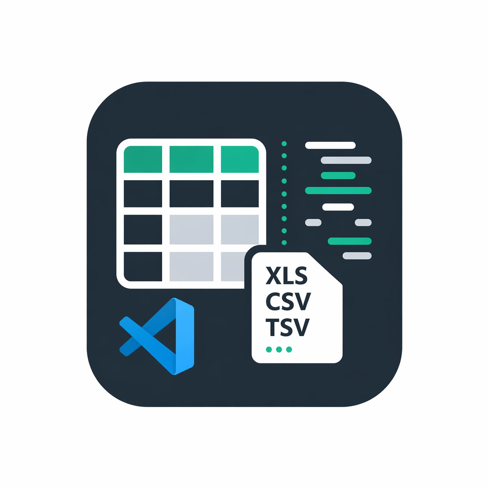

  
  <h1>CSV / XLS Table Viewer</h1>
  
<strong>Your data. A clearer view. Inside VS Code.</strong>

  
Explore, filter, and edit tabular files without leaving your editor.

  
<strong>English</strong> · <a href="README.es.md">Español</a>

  
<a href="#get-started">Get started</a> · <a href="docs/DEVELOPMENT.md">Development</a> · <a href="https://github.com/lnavarrocarter/vscode-table-viewer/issues">Report an issue</a>

---

## A table where you need it

Turn CSV, TSV, XLSX, XLS, and ODS files into an interactive table. Inspect an export, find a record, or make a quick cell edit in your existing VS Code workspace.

- **Find what matters.** Search across all cells with a global, case-insensitive filter.
- **Explore by column.** Click a header to sort; click again to reverse the order.
- **Edit in place.** Double-click a cell, update its value, and save to the original file.
- **Stay in your editor.** Theme-aware styling, sticky column headers, row numbers, and horizontal and vertical scrolling.
- **Keep your delimiter.** CSV delimiters are detected automatically and retained when saving; TSV uses tabs.

## Get started

Requires **VS Code 1.85 or later**.

1. In VS Code, open **Extensions** and search for `CSV / XLS Table Viewer` by `lnavarrocarter`.
2. Install the extension and open a supported file.
3. If it opens as text, right-click its editor tab and choose **Reopen Editor With… → Table Viewer**.
4. Double-click a cell to edit, then use **Save changes** or **Ctrl+S** / **Cmd+S**.

You can also install a `.vsix` from [GitHub Releases](https://github.com/lnavarrocarter/vscode-table-viewer/releases) using **Extensions → … → Install from VSIX…**. To build a package locally, see the [development guide](docs/DEVELOPMENT.md).

## Supported formats

| Format | Reading and saving |
| --- | --- |
| CSV | UTF-8 text; automatic delimiter detection, retained on save |
| TSV | UTF-8 text with tab separators |
| XLSX | First worksheet, displayed as text values |
| XLS | First worksheet, displayed as text values |
| ODS | First worksheet, displayed as text values |

The first row becomes the column headers. Empty headers receive names such as `Col1`; blank CSV/TSV lines are skipped.

**Workbook saving:** XLSX, XLS, and ODS files are rebuilt as a single worksheet named `Sheet1`, containing text values. Other worksheets, formulas, formatting, and original cell types are not preserved. Work on a copy when you need to keep those features.

## Everyday controls

| Action | Control |
| --- | --- |
| Sort a column | Click its header; click again to reverse |
| Filter rows | Type in **Filter rows** |
| Edit a cell | Double-click the cell |
| Confirm an edit | Press **Enter** or click outside |
| Cancel an edit | Press **Escape** |
| Edit the next cell in the same row | Press **Tab** while editing |
| Save | **Save changes**, **Ctrl+S** (Windows/Linux), or **Cmd+S** (macOS) |
| Open as text | Right-click the tab → **Reopen Editor With… → Text Editor** |

Sorting and filtering affect the view only; they do not reorder or remove saved rows. Search matches cell values, not column headers.

## Current scope

Table Viewer focuses on inspecting data and editing existing cells. It does not provide worksheet selection, formula calculation, header editing, or row/column insertion. All rows render at once, so very large files may be slow. Undo/redo and revert update the document model, but the current table view does not refresh automatically for those operations.

## Documentation and support

- [Development, packaging, and release guide](docs/DEVELOPMENT.md)
- [Documentación en español](README.es.md)
- [Issues and feature requests](https://github.com/lnavarrocarter/vscode-table-viewer/issues) — include your VS Code version, file format, reproduction steps, and a small anonymized sample.

## Author and license

Created by [lnavarrocarter](https://github.com/lnavarrocarter). Released under the [MIT License](LICENSE).
